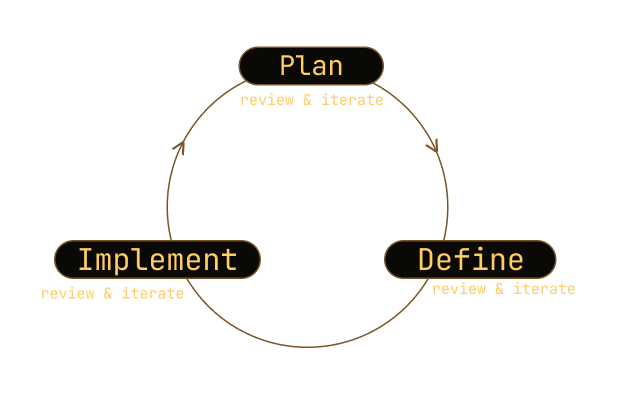

# How It Works
Micromanaged Driven Development (MMDD) turns AI from an unpredictable code generator into a reliable partner by combining granular control with systematic documentation.
Instead of starting with a broad, open-ended request to the AI and hoping for the best, MMDD breaks work into small, reviewable units. At every stage, you review and iterate with the AI until the result matches your intent — before moving on.

## The MMDD Loop

- Plan – At the start of a project, state clearly what you want to build. For each new unit, work with the AI to define its scope: ask what it’s about, explore possible decisions, choose your direction, and document your choices.
- Define – Ask the AI to write the unit in detail. Review and refine until it’s exactly what you want.
- Implement – Tell the AI: “Implement this unit.” Test the generated code, review it, and make adjustments as needed.

## Why It Works
- Predictable AI results – Controlled scope reduces hallucinations.
- Maintainable code – Documentation creates a permanent audit trail.
- Faster onboarding – New developers can trace the “why” behind every change.
- Confidence in changes – Small steps mean safer, reversible decisions.

**MMDD works!** — MMDD itself was defined using MMDD. Even this website was built with MMDD, with every prompt, change, and decision recorded in its commit history.
See it in action on GitHub and try it on your next AI coding session.

